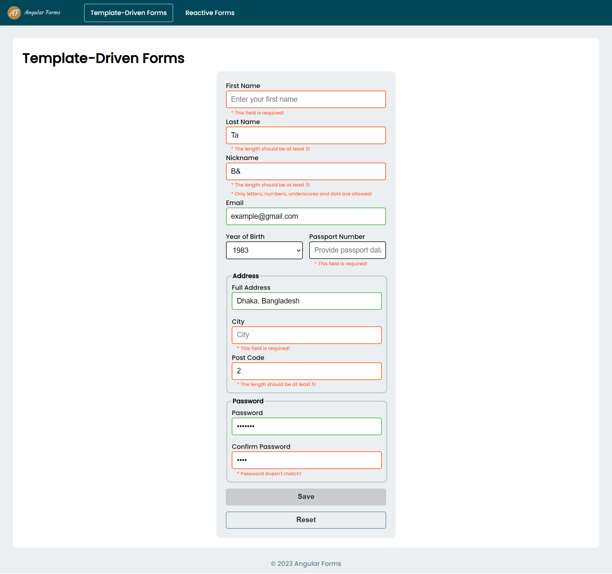
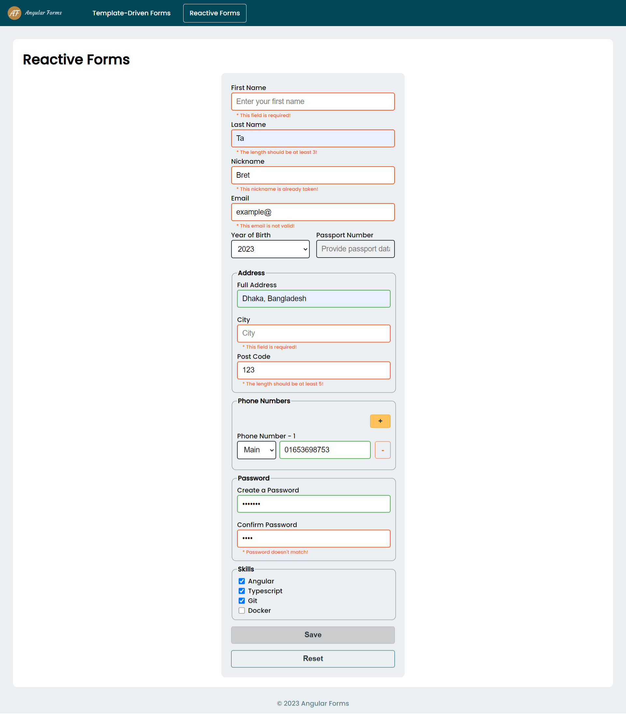

# Angular Forms

This repository contains an Angular web application that demonstrates the implementation of forms using the Angular framework. The forms are styled using SCSS, providing a visually appealing user interface and include various types of validation for giving users visual feedback about the correctness of entered inputs. The application showcases both the template-driven and reactive approaches for form creation and utilizes routing to navigate between the two.

## Features

This web application includes the following features:

* **Template-driven forms:** This approach utilizes Angular's template-driven forms, where the form controls and validation rules are defined within the HTML template.
* **Reactive forms:** This approach uses Angular's reactive forms, which provide a more flexible and powerful way of handling form inputs and validation. The form controls and validation rules are defined programmatically in the component.
* **Form validation:** The application demonstrates various types of form validation, including required fields, minimum and maximum length constraints, pattern-based validation, and custom validation rules.
* **Submit button:** The form includes a submit button that triggers the form submission process. When the form is valid, the data is submitted and processed accordingly.
* **Reset button:** The form also provides a reset button that allows users to clear all form inputs and reset the form to its initial state.
* **Routing:** The application uses Angular's routing feature to navigate between the template-driven and reactive forms. Users can switch between the two forms by clicking on the corresponding links in the navigation menu.

## Technologies Used

This web application is built using the following technologies:

* **Angular:** It is a TypeScript-based open-source framework for building web applications that provides a robust platform for developing scalable and maintainable applications with features such as component-based architecture, dependency injection, and declarative templates.
* **SCSS:** It is a CSS preprocessor that extends the capabilities of CSS with variables, mixins, nested rules, and more that allows for modular and reusable styling, making it easier to manage and maintain the application's CSS code.
* **TypeScript:** It is a superset of JavaScript that compiles to plain JavaScript and it brings static typing and additional features to JavaScript, enhancing the development experience and enabling better tooling and code organization.
* **Angular Routing:** It is a feature of Angular that enables navigation and routing between different views and components within an application.
* **Git:** It is a distributed version control system that allows for efficient tracking of changes to source code which is used for cloning the repository, managing branches, and collaborating with other developers.

These technologies work together to create a seamless and responsive web application, providing users with an efficient and user-friendly experience.

## 🛠 Installation and Setup Instructions

1. git clone https://github.com/tawfik575/angular-forms.git
2. cd angular-forms
3. npm install
4. ng serve --open

## Contributing

Contributions to this web application are welcome! If you find a bug or have an idea for an improvement, please submit an issue or create a pull request. Make sure to follow the existing code style and provide detailed information about your changes.

## License

This project is licensed under the MIT License. Feel free to use, modify, and distribute the code as per the terms of the license.

## Contact

If you have any questions, suggestions, or feedback about the project, feel free to contact me at `tawfikbsmrstucse@gmail.com`.
